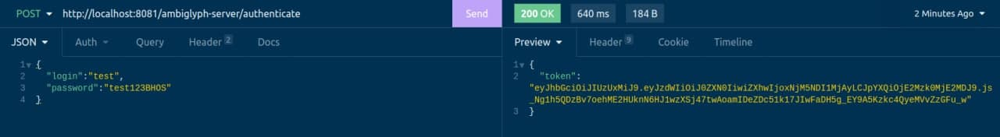
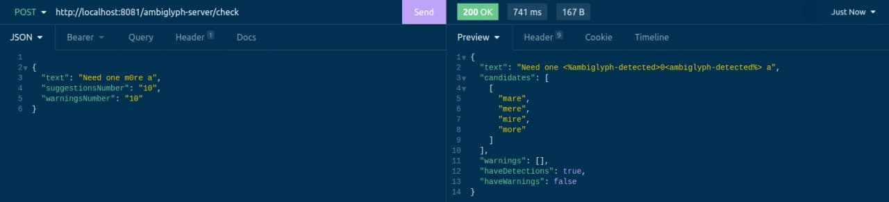
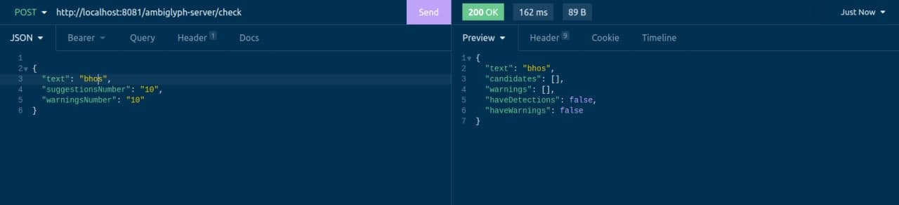
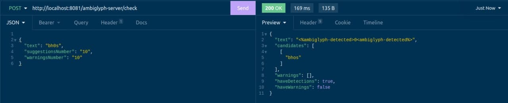

# Ambiglyph Server
<div align="center">

<h2>Ambiglyph</h2>
</div>


**Ambiglyph Server** - the implementation of the Ambiglyph project backend. it is fully written in Java with Spring technology thats provide powerful API.

It can detect homoglyphs inside a text and give suggestions to recover it using Levenshtein algorithm.  The main approach is to use the algorithm as it used for misspells fixing.  An user will be provided with suggestions how with which word obfuscated one can be replaced.

The server uses open database of words and homoglyps: http://homoglyphs.net/

and database of words: http://www.mieliestronk.com/corncob_lowercase.txt


## Build

### Manual Build/Run

**Requirements**

- Java 17

- MySQL Server 8

- Maven 3.8.+

Run in the project root directory

```bash
mvn spring-boot:run
```

### Docker Image

**Requirements**

- Docker

Just run in the project folder:

`````bash
docker build -t ambiglyph-server -f Dockerfile
docker run -p 8081:8081 -t ambiglyph-server
`````

## Usage

This is simple backend application that uses REST API. Hence, it supports only REST requests. To try it out without any front application application you can use Inomina or Postman. All necessary documentation provided in Swagger (OpenApi v3). You can access it like `http://api-address:8081/ambiglyph-server/swagger-ui/index.html`.

Overall, the application supports **CRUD** operations on database of words and users. It is required to be authenticated and use given JWT-token in headers  Some basic operations:

`POST /authenticate/` 

Authentication. In case of successful authentication a JWT token will be provided as a response. Example:



Default passwords:

| Username     | Password    |
| ------------ | ----------- |
| ADMIN        | ADMIN       |
| test         | test123BHOS |
| client ***** | client      |

`*` This login can be used for unauthorized users to check using only the general word database. Recommended for client applications.* 


`POST /users/`

Register a new user. The operation accessible only by users with role ADMIN and APP. 

`POST /words/`

Add a new word to database

`GET /words/`

Get all words added by current user

`GET /words/{id}`

Get word with `{id}`

`POST /check/`

Send text to check.

All  words that are detected to be spoofed will be replaced with `<%%ambiglyph-detected>`**num**`<ambiglyph-detected%%>`, where **num** - the number of a detection.

Also, if the number of suggested word is higher than given limit and there is a letter that is in the homoglyph database, the letter will be replaced with `<%%ambiglyph-warning>`**num**`<ambiglyph-warning%%>` , where **num** - the number of a warning.

In case of any detection or warning corresponding values in the response will be marked as true.

Example:



For more requests and their structure as well as their supposed output, please take into consideration controllers and DTO in source code.

The key point of separating database users is to add an ability to add words that they use regularly, but this words specific and it is impossible to add them to the shared database. Example:

 

There is no detection since the word wasn't found in database at all but it its obfuscate it. However, by adding the original word to database will help to address the problem.


